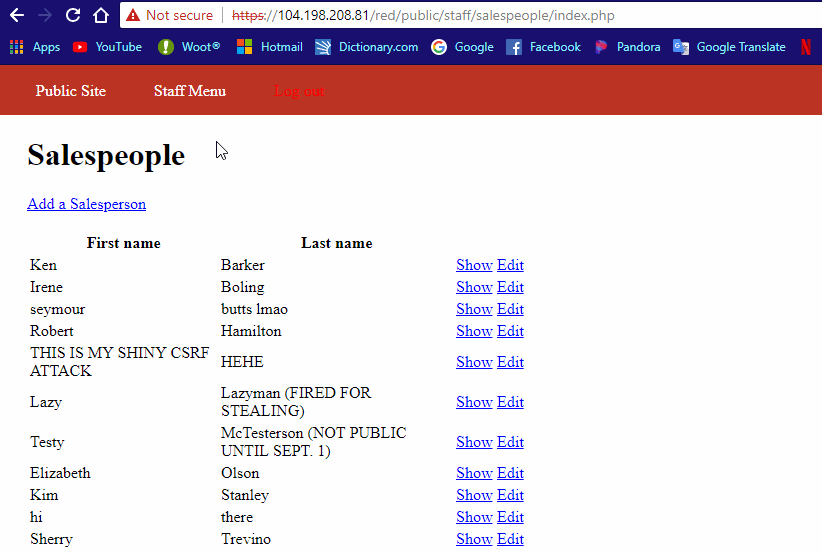

# Project 8 - Pentesting Live Targets

Time spent: 5 hours spent in total

> Objective: Identify vulnerabilities in three different versions of the Globitek website: blue, green, and red.

The six possible exploits are:
* Username Enumeration
* Insecure Direct Object Reference (IDOR)
* SQL Injection (SQLi)
* Cross-Site Scripting (XSS)
* Cross-Site Request Forgery (CSRF)
* Session Hijacking/Fixation

Each version of the site has been given two of the six vulnerabilities. (In other words, all six of the exploits should be assignable to one of the sites.)

## Blue

Vulnerability #1: SQL Injection
    
    Adding Sleep(5) caused the page to take 5 seconds to load showing that the sql statement was injected

Vulnerability #2: Session Hijacking/Fixation
    
    After changing the session id, on the new browser I was able to log in without having to sign in

## Green

Vulnerability #1: Username Enumeration
    
    When the user exists, the Log In part is bolded

Vulnerability #2: Cross-Site Scripting
    
    When the admin opens the feedback page, the code submitted in the feedback box gets run

## Red

Vulnerability #1: Insecure Direct Object Reference (IDOR)
    
    By changing the url, it is possible to find Testy Mctesterson who is not supposed to be visible

Vulnerability #2: Cross-Site Request Forgery (CSRF)
    
    If an admin goes to the link left in the feedback the it will change the user's name

## Notes

Figuring out how to get the CSRF to run was difficult
